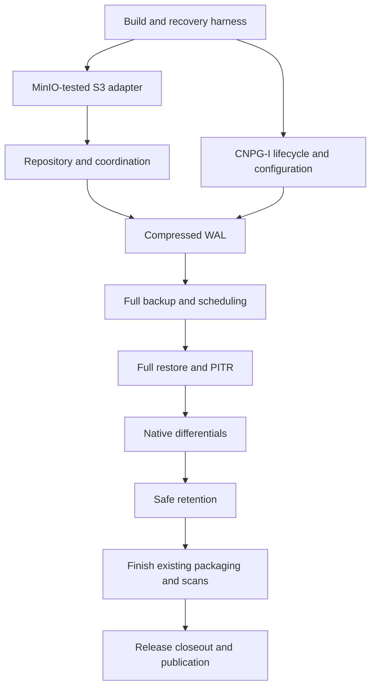

# PR delivery plan

Status: **implementation graph, activated only by READY**, governed by the frozen [design](design.md), [release policy](release-policy.md) and issue #14 READY gate. PR means a planned implementation slice, not a pull request already opened. The [separate GitHub delivery epic](https://github.com/djosh34/cnpg_backup/issues/3) is the executable backlog; the [Wayfinder map](https://github.com/djosh34/cnpg_backup/issues/1) resolves design decisions. All technical/design blockers and the final owner grill are resolved before the READY handoff. Read [EXECUTE.md](EXECUTE.md) for autonomous implementation, Paseo role-based thinking and 1800-second waits, independent reviews, automatic merges and restart behavior. This graph may be adjusted when evidence changes the best PR boundary; safety and acceptance goals remain binding.

Each PR includes its own documentation and tests. Run the [local-first feedback ladder](testing.md#local-first-feedback) before expensive hosted matrices; keep a single subject association per test/review record and preserve exact release-image identity. [testing.md](testing.md) defines mandatory test tiers and the two-hour manual/reusable GitHub Actions recovery campaign; [agents/review.md](agents/review.md) defines two independent reviews and evidence-based disposition. All Go runtime builds use `CGO_ENABLED=0`; justify PostgreSQL tool exceptions. Keep simulation machinery in test code, not the product. Planning source/PG18/MinIO experiments already exist under docs/research; reuse their distinguishing assertions in the real harness without counting research scripts as product qualification. Finish independent final design review and commit/push before READY. Do not schedule a redundant initial documentation PR if the required plan is already in git.

## PR A — Establish build, dependency policy and recovery test harness

**Goal:** a reproducible, CGO-free foundation and a real PG18 test oracle before developing backup logic.

**Requirements**
- Go module/toolchain pin, standard formatting/vet/unit CI, dependency inventory and policy, manager/data-path image build skeletons.
- Native PostgreSQL tools only as approved; no Python/Barman/pgBackRest in final images. Verify linked Go packages rather than relying on an empty-looking go.mod.
- Integration harness starts disposable PG18 and S3 test storage, writes identifiable transactions, captures/reconstructs/verifies a native full+differential, and queries restored data. Test tooling can be heavier than the shipped runtime.
- Test datasets and orchestration are reproducible; credentials and destructive targets are isolated. Establish the local/CI test entry point, version/seed/event artifact format and short Actions integration job. Keep one harness, not a custom test platform.

**Acceptance**
- Production Go binary builds and runs with CGO disabled on supported architecture(s); CI inventories final images and transitive runtime code.
- Harness proves a native full+differential recovery round trip and intentionally detects corruption; its failure is visible in CI.
- Test-only dependencies/tools are absent from runtime images; supported-version inputs are explicit.

**Depends on:** approved native engine/tool policy, deployment support matrix and security/dependency policy.
**Not included:** implementation of backup/S3/CNPG features or a new test framework.

## PR B — Implement the MinIO-tested SigV2/SigV4 S3 adapter

**Goal:** one small tested adapter around the approved Go SDK.

**Requirements**
- Configured SigV2/SigV4, endpoint/addressing, private CA and explicit credentials; no anonymous or signing downgrade fallback.
- Streaming get/put, paginated list, metadata/checksum handling, file-backed known-length Core multipart primitives, explicit gate-owned abort/delete and tested conditional operations. Do not allow the high-level SDK multipart error path to perform uncoordinated abort.
- Cancellation, bounded retries and typed error categories; no ETag-as-SHA256 assumption.

**Acceptance**
- HTTP fault tests cover response loss after committed upload, interrupted multipart, auth/TLS failure, rate limiting, pagination and checksum mismatch.
- Real MinIO integration exercises SDK SigV2/SigV4, private CA, multipart and every storage primitive used by publication/deletion. Record standard-S3 assumptions and exact tested versions.
- Buffer use stays bounded for objects larger than configured buffers; aborted work cannot be confused with committed data.

**Depends on:** PR A; approved S3 compatibility and repository protocol decisions.
**Not included:** custom S3 signing, generic multi-cloud interface, backup catalog.

## PR C — Implement immutable repository metadata and coordination

**Goal:** backup selection and mutation remain correct across retries, crashes and competing operations.

**Requirements**
- Versioned repository identity, original PG manifests, immutable artifact metadata, commit-last publication and operation idempotency.
- Validated full/differential parent graph, standalone S3 catalog enumeration and explicit rejection of unsupported schemas.
- Implement the simplest approved one-writer-cluster coordination/no-clobber contract, including failover/stale work and the repository-wide restore/deletion admission protocol finalized before READY. Do not build a distributed lock/reader-lease service for unsupported multi-writer topologies.
- Add deterministic simulation of the actual production modules at storage/operation seams: controlled completion order, persisted fake state across restarts, seeded trace, independent oracle and bounded replay.
- Interrupted uploads remain unselectable; orphan cleanup is conservative and bounded.

**Acceptance**
- Fault injection before/after every publication boundary proves no incomplete backup is selectable.
- Duplicate Backup UID replay returns the committed result; concurrent differing content cannot overwrite committed objects.
- Deleted Kubernetes Backup resources do not remove discoverability; malformed/cyclic/missing references fail closed.
- Fuzz metadata/path limits; verify documented concurrent backup/retention/restore behavior. Fixed-seed simulations reproduce identical modeled traces and detect deliberately invalid publication/retention outcomes; do not substitute a toy model for exercising production code.

**Depends on:** PR B; approved repository and retention coordination decisions.
**Not included:** custom content-addressed chunk store or mutable global catalog database.

## PR D — Integrate CNPG-I lifecycle and configuration

**Goal:** CNPG can discover and safely place the plugin in database pods and restore jobs.

**Requirements**
- Identity/capabilities, manager gRPC security/discovery, instance/restore Unix sockets, idempotent lifecycle patches, configuration schema and validation.
- Namespaced Secret/private CA projection, validated operation-snapshot reload, minimal RBAC and restricted containers. Pin the v0.5-operator/v0.6-plugin wire subset; lifecycle mounts and installs the exact static helper outside /plugins before main startup.
- Reuse Backup/ScheduledBackup/Cluster recovery configuration; no second scheduler.
- Advertise only implemented capabilities at each merge; safe unsupported-feature errors until data-path PRs land.

**Acceptance**
- Real CNPG/Kubernetes tests install/uninstall and restart the manager, validate TLS/cert rotation and repeatedly reconcile without duplicate mounts/sidecars or unwanted pod churn.
- Multi-instance cluster gets required sidecars; missing credentials or incompatible PG/Kubernetes/CNPG settings fail clearly.
- Golden configuration and lifecycle tests include source/target repositories, separate WAL volumes and supported tablespace mounts. K1/S2: wrap the original recovery argv with PID1 `recovery-guard` before CNPG preflight; locks plus fsynced owner markers cover every target volume. Implement the narrow local Begin/Drain session on the existing Unix socket, startup-probe ordering and Pod/guard/sidecar-incarnation validation. Private PID namespace/descendant reaping and marker-on-crash are tested; no sidecar-lock-only substitute.

**Depends on:** PR A; approved CNPG contract, deployment/configuration and security decisions.
**Can run in parallel with:** PR B and PR C.
**Not included:** data-plane proxy, generalized Kubernetes operator framework, invented compatibility with Barman ObjectStore.

## PR E — Ship and restore compressed WAL through CNPG-I

**Goal:** establish the archive before building backups on top of it.

**Requirements**
- Go Archive/Restore handlers, gzip, content checksums, duplicate-content verification, no-clobber keys, safe temporary-file publication and sync.
- Correct missing-file versus storage-failure mapping; history files, supported nondefault WAL sizes and rewind semantics.
- No early acknowledgment/local durability queue; WAL capacity separate from backup transfer capacity.
- Archive lag/failure metrics and required PostgreSQL configuration checks are included now.

**Acceptance**
- Real PG18/CNPG archives a segment and retrieves byte-identical contents through the plugin; `.history` handling works.
- Identical re-archive succeeds, differing bytes fail; killed uploads, TLS failures and disk-full restores never return success.
- A temporary storage failure cannot masquerade as archive exhaustion; callbacks remain serviceable during a large simulated backup upload.
- Forced failover produces retrievable timeline history and correct archive routing.

**Depends on:** PR C and PR D; approved WAL/recovery contract.
**Not included:** separate WAL receiver, speculative prefetch, promise of zero RPO.

## PR F — Capture full backups and schedule them via CNPG

**Goal:** a real on-demand/scheduled full backup with honest completion semantics.

**Requirements**
- Managed native-tool subprocesses and replication auth, safe disk workspace, PG manifests, bounded compression/upload and commit publication.
- Tool compatibility, mandatory CNPG tablespace/separate-WAL support, cancellation/process reaping and operation retries. Preflight rejection applies only to layouts outside the agreed initial support; never use it to omit the agreed layouts.
- Bundled bootstrap WAL and approved archive availability checks; CNPG result timestamps/LSNs/metadata are accurate.
- Example native CNPG ScheduledBackup; no custom cron loop. Extend real-system fault scenarios and DST to capture/retry/cancellation; archive/backup acknowledgments are checked by the harness.

**Acceptance**
- Backup and ScheduledBackup produce committed catalog entries whose downloaded artifacts pass the approved integrity workflow and can be restored in the harness. R0: all `pg_verifybackup` calls use `--no-parse-wal`; Go directly executes `pg_waldump` for every validated manifest range. Test the shell-free data image, including required-WAL rejection; no shell allowlist exception.
- SIGTERM, OOM/process death, full workspace, missing credentials and timeout after commit give correct status/idempotent retry behavior.
- Workload writes continue during capture; fixtures with supported tablespaces are not silently omitted.
- An interrupted full is never chosen as a differential parent or retention replacement.
- Ship per-type last-success timestamp and failed-backup counters with full backups, using the metric contract in design.md. Failed attempts do not refresh success; failures surface in status and Warning events. Test freshness/failure alerts rather than defer basic observability to PR J.

**Depends on:** PR E; approved native engine/staging and recovery semantics.
**Not included:** production-ready release before end-to-end recovery exists.

## PR G — Bootstrap full restores and PITR in CNPG

**Goal:** demonstrate actual disaster recovery before adding dependent backups.

**Requirements**
- S3-only catalog resolution, eligible-backup/timeline selection, secure extraction and original-input verification, custom WAL directory handling, restore-job integration. CNPG replays inside the Job: return the direct wal-fetch helper command, exit1 only on verified allowed absence and exit255 on required gaps/storage/helper failures; stock CNPG error exits are not safe for latest PITR.
- Respect CNPG recovery targets and PostgreSQL replay semantics; explicit backup selection where target inference is unsupported.
- Source archive read versus target archive write identity separation, automatic repository-wide deletion protection for plugin-managed restores (including cross-cluster restores; arbitrary external S3 readers are out of scope), durable target plan, main-owned target guard through preflight/replay/descendant termination and sidecar drain, and capacity preflight. Controller releases only stable lifecycle protection after proven Job/Pod completion; uncertain process-reader holders remain.
- Introduce manually dispatched, reusable recovery workflow calling the same local harness. It can run the currently implemented full/PITR scenarios with seed, exact image digest and bounded duration, retaining failure evidence. It must not yet claim differential/retention qualification.

**Acceptance**
- Recover latest, timestamp and LSN targets plus explicit backup ID; restore-point/XID behavior matches the approved support contract.
- Query before/after-target sentinels and recover a deliberately dropped table to a pre-drop target. Require a target beyond the selected backup's bundled WAL, prove remote post-backup WAL replay, and fail recovery when a required post-backup archive segment is missing/corrupt.
- Restore into a fresh namespace/cluster after deleting source Kubernetes catalog objects; no source database connection is required.
- Missing/corrupt required data, unreachable explicit target and transient S3 failure cannot yield falsely successful recovery. S1: intact bundled WAL/no archive duplicate recovers with ordinary local fallback; same-final-segment post-EndLSN archive data takes preference over padding. Required remote gaps and TLS/auth/transport/corruption remain 255 with local bundles present.
- K1/S2: paused old main, delayed RestoreResponse, replay and shutdown block replacement preflight without any target mutation. Sidecar/guard crash poisons markers; detached PG children and outstanding sidecar writes block clean release. Close admission/drain before release; stale tuples cannot write after a new owner. Test fresh-Cluster/all-fresh-PVC retry after poison. Model-only evidence does not satisfy these real CNPG/PID-namespace regressions.

**Depends on:** PR F; approved recovery and reader coordination decisions.
**Not included:** in-place destructive recovery, plugin reimplementation of WAL replay.

## PR H — Add native differential capture and reconstruction

**Goal:** ship space-efficient backups without a custom filesystem diff engine.

**Requirements**
- Select an eligible full root and preserve its exact manifest; invoke native incremental capture and record direct full parent.
- Validate WAL summary availability/configuration and PG identity/checksum/timeline restrictions. A requested differential fails on invalid prerequisites; never run a replacement full backup or offer a fallback setting. Extend per-type last-success/failure metrics and alerts.
- Download/verify full+differential, combine and verify synthetic full, then reuse CNPG PITR path. R0 applies independently to every original and synthetic manifest: `pg_verifybackup --no-parse-wal` plus direct Go `pg_waldump` for each validated range, with negative controls and no data-image shell.
- Report required workspace and actual transfer sizes; never quietly change a requested mode.

**Acceptance**
- Multiple differentials reference one full; restoring a selected differential succeeds after deleting an unrelated intervening differential.
- Update/delete/truncate/drop/recreate fixtures restore correctly; largely unchanged fixture shows reduced transfer.
- Missing full, missing summaries, checksum changes, promotion and cancellation fail explicitly. Tests prove no replacement full command/upload starts, no success timestamp advances, and failure status/Warning events and the requested-type failure counter are emitted as defined.
- Full+differential+WAL recovers around a sentinel target beyond the differential's bundled-WAL coverage; metadata survives process/Kubernetes object loss. Add these cases and missing-summary/parent faults to the real-system campaign and the deterministic regression corpus.

**Depends on:** PR G; approved backup mode/chain policy.
**Not included:** arbitrary incremental chains, synthetic full compaction in S3 or content-defined deduplication unless explicitly added by a later decision.

## PR I — Enforce dependency-safe automated retention

**Goal:** delete only data proven unnecessary for promised recovery.

**Requirements**
- Pure explainable keep/delete planner, window anchor, full-root safety floor, dependency closure and timeline-aware WAL reachability.
- Periodic bounded execution/dry-run, nonexpiring active backup/restore protection, permanent retirement metadata/WAL slots and gate-owned orphan cleanup. A new process may replan after a conclusively released batch, never take over an ambiguous destructive owner.
- Respect stronger local dependency requirements when receiving CNPG first-required-WAL hints.
- Missing metadata/storage uncertainty stops deletion; bucket age-only expiry of live data is documented as incompatible.

**Acceptance**
- Property tests over backup/timeline graphs preserve every kept restore plan and its required WAL.
- Full older than the retention cutoff survives while a retained differential depends on it; last usable full survives prolonged backup failure.
- Retention racing backup, restore and manager failover remains safe under approved topology, including cross-cluster restore policy.
- Kill at every deletion step and retry; restores inside the window still pass, expired selections fail clearly and no incomplete backup is selectable. Extend the manual campaign and independent DST oracle with backup/retention/restore interleavings and failed protection acknowledgment. Prove protection covers post-bootstrap WAL replay and crashed/paused recovery, drains in-flight deletion before admission and emits a Warning event when retention is blocked.

**Depends on:** PR H; approved retention semantics/coordination.
**Not included:** reference-counting chunk GC or remote synthetic full compaction.

## PR J — Finish existing packaging and scans

> **MINIMAL RELEASE CLOSEOUT / NOT NEW FEATURE WORK. A lot smaller than the original scope; MUST NOT OVERENGINEER.** [Owner resolution](https://github.com/djosh34/cnpg_backup/issues/24#issuecomment-5598040876) supersedes the earlier checklist and signing gates. [Existing PR #40](https://github.com/djosh34/cnpg_backup/pull/40).

**DONE — do not repeat:** merged G crashed-restore protection and I retention safety; I full [34306264258](https://github.com/djosh34/cnpg_backup/actions/runs/34306264258) passed 35 families/57 branches. J operations/runbooks/alerts are implemented; actual b408 run3 passed BOTH operational families: resource/WAL-under-transfer measurements, valid STS/CA rotation, rolling update and retained F/D/WAL SQL recovery, with conclusive cleanup. Initial-format fixtures exist. Reuse applicable evidence, not old-image qualification for changed bytes.

**Only remaining:** narrowly review existing scanner-marker/exact-image-reuse fix (7ca..f221); remove signing-only workflow steps/gates/permissions without rebuilding b408; obtain actual same-digest govulncheck/Trivy/SBOM results and dispositions. Collect existing full [34320551460](https://github.com/djosh34/cnpg_backup/actions/runs/34320551460) and applicable PR checks; resolve observed failures, then parent reviews/merges J. Prior scan/smoke failures remain failed until properly resolved, not waived. No new J operational implementation or reruns solely for already-passed gates. PR acceptance is not final exact-artifact qualification.

**Non-goals:** G/I reimplementation, new frameworks/abstractions, extra observability, optional assertions, new test matrices, blanket CI restarts, signing/attestation, Checkmarx. **Checkmarx UNAVAILABLE / N-A: no scan, no purchase gate.** Preserve reviewed good code; no deletion churn to shrink wording.

**Depends on:** merged I. Parent alone owns the bounded finish sequence; no new design/approval phase.

## PR K — Package and publish the release

> **MINIMAL RELEASE CLOSEOUT / NOT NEW FEATURE WORK. A lot smaller than the original scope; MUST NOT OVERENGINEER.** [Owner resolution](https://github.com/djosh34/cnpg_backup/issues/25#issuecomment-5598041120).

**DONE / reusable:** G–I implementation and actual I 35/57 evidence; J's actual operational results and retained hashed initial-format fixtures above. **First-release predecessor N-A**, not another upgrade campaign. Historical failures remain disclosed. No new artifact/image signing, Sigstore/OIDC attestations or signature verification; historical signatures are not gates.

**Only remaining:**
1. After J acceptance, collect evidence against the exact candidate bytes. Use the existing harness for **only actually missing mandatory evidence**, including the existing 20-minute total fuzz requirement if not evidenced; do not restart a matrix for a documentation/signing-only change. Keep subject/harness identity, SQL/no-data-loss/ownership assertions, security dispositions and resource evidence. Earlier-image results cannot qualify changed bytes; partial runs or a timer cannot establish qualification.
2. Assemble persistent v0.1.0 assets: existing binary, both portable OCI archives, checksums, digest-pinned manifests/runbooks, notices/corresponding sources, actual SBOMs, compatibility/qualification summary and retained synthetic fixtures/regressions. Existing recovery aggregates deliberately say `release_qualified=false`; final closeout accounts for all applicable evidence, not a flag flip or a new qualification framework.
3. Parent publishes the GitHub versioned release and GHCR version tags on those **same tested digests**, without rebuild, tag overwrite, signing or production deployment. Any necessary release glue is limited to assembling/validating/publishing existing outputs; no product feature work.

**Non-goals:** G/I reimplementation, new frameworks/abstractions, extra observability, optional assertions, new test matrices, blanket CI restarts, signing/attestation, Checkmarx. Checkmarx remains **UNAVAILABLE / N-A; no scan or purchase gate**. Failing/unexecuted applicable mandatory evidence still blocks release; all-rights-reserved and third-party obligations remain.

**Depends on:** J acceptance; unchanged safety/security/exact-byte gates except the explicitly removed signing requirement.

## Implementation graph

Decision dependencies also exist in GitHub's native blocker relationships; this diagram shows implementation ordering only. PR B/C and PR D are the main early parallel tracks. Test work is continuous across all tracks.
