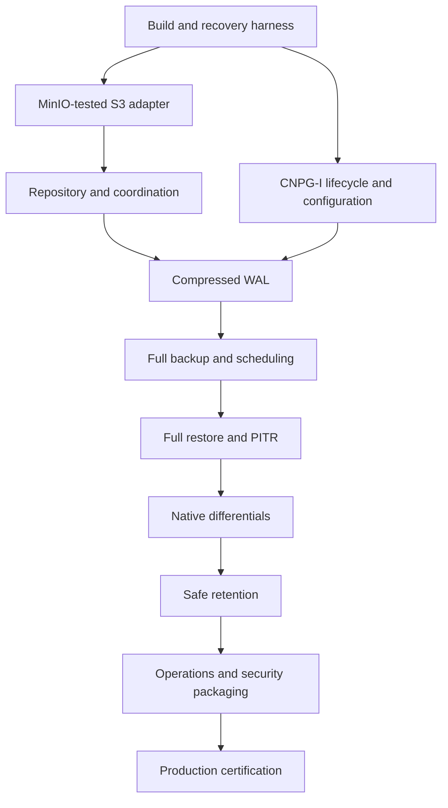

# Proposed PR delivery plan

Status: **draft**. PR means a planned implementation slice, not a pull request already opened. The [separate GitHub delivery epic](https://github.com/djosh34/cnpg_backup/issues/3) is the executable backlog; the [Wayfinder map](https://github.com/djosh34/cnpg_backup/issues/1) resolves design decisions. All technical/design blockers and the final owner grill are resolved before the READY handoff. Read [EXECUTE.md](EXECUTE.md) for autonomous implementation, Paseo Astra/high workers, independent reviews, automatic merges and restart behavior. This graph may be adjusted when evidence changes the best PR boundary; safety and acceptance goals remain binding.

Each PR includes its own documentation and tests. [testing.md](testing.md) defines mandatory test tiers and the two-hour manual/reusable GitHub Actions recovery campaign; [agents/review.md](agents/review.md) defines two independent reviews and evidence-based disposition. All Go runtime builds use `CGO_ENABLED=0`; justify PostgreSQL tool exceptions. Keep simulation machinery in test code, not the product. Planning files are committed as a planning snapshot at the owner's request; finish and commit the final design before READY. Do not schedule a redundant initial documentation PR if the required plan is already in git.

## PR A — Establish build, dependency policy and recovery test harness

**Goal:** a reproducible, CGO-free foundation and a real PG18 test oracle before developing backup logic.

**Requirements**
- Go module/toolchain pin, standard formatting/vet/unit CI, dependency inventory and policy, manager/data-path image build skeletons.
- Native PostgreSQL tools only as approved; no Python/Barman/pgBackRest in final images. Verify linked Go packages rather than relying on an empty-looking go.mod.
- Integration harness starts disposable PG18 and S3 test storage, writes identifiable transactions, captures/reconstructs/verifies a native full+differential, and queries restored data. Test tooling can be heavier than the shipped runtime.
- Test datasets and orchestration are reproducible; credentials and destructive targets are isolated. Establish the local/CI test entry point, version/seed/event artifact format and short Actions integration job. Keep one harness, not a custom test platform.

**Acceptance**
- Production Go binary builds and runs with CGO disabled on supported architecture(s); CI inventories final images and transitive runtime code.
- Harness proves a native full+differential recovery round trip and intentionally detects corruption; its failure is visible in CI.
- Test-only dependencies/tools are absent from runtime images; supported-version inputs are explicit.

**Depends on:** approved native engine/tool policy, deployment support matrix and security/dependency policy.
**Not included:** implementation of backup/S3/CNPG features or a new test framework.

## PR B — Implement the MinIO-tested SigV2/SigV4 S3 adapter

**Goal:** one small tested adapter around the approved Go SDK.

**Requirements**
- Configured SigV2/SigV4, endpoint/addressing, private CA and explicit credentials; no anonymous or signing downgrade fallback.
- Streaming get/put, paginated list, metadata/checksum handling, bounded multipart upload/abort, delete and verified conditional operations needed by the chosen repository protocol.
- Cancellation, bounded retries and typed error categories; no ETag-as-SHA256 assumption.

**Acceptance**
- HTTP fault tests cover response loss after committed upload, interrupted multipart, auth/TLS failure, rate limiting, pagination and checksum mismatch.
- Real MinIO integration exercises SDK SigV2/SigV4, private CA, multipart and every storage primitive used by publication/deletion. Record standard-S3 assumptions and exact tested versions; no Dell access, test or certification gate.
- Buffer use stays bounded for objects larger than configured buffers; aborted work cannot be confused with committed data.

**Depends on:** PR A; approved S3 compatibility and repository protocol decisions.
**Not included:** custom S3 signing, generic multi-cloud interface, backup catalog.

## PR C — Implement immutable repository metadata and coordination

**Goal:** backup selection and mutation remain correct across retries, crashes and competing operations.

**Requirements**
- Versioned repository identity, original PG manifests, immutable artifact metadata, commit-last publication and operation idempotency.
- Validated full/differential parent graph, standalone S3 catalog enumeration and explicit rejection of unsupported schemas.
- Implement the simplest approved one-writer-cluster coordination/no-clobber contract, including failover/stale work and retention-pause acknowledgment for external/read-only restore. Do not build a distributed lock/reader-lease service for unsupported multi-writer topologies.
- Add deterministic simulation of the actual production modules at storage/operation seams: controlled completion order, persisted fake state across restarts, seeded trace, independent oracle and bounded replay.
- Interrupted uploads remain unselectable; orphan cleanup is conservative and bounded.

**Acceptance**
- Fault injection before/after every publication boundary proves no incomplete backup is selectable.
- Duplicate Backup UID replay returns the committed result; concurrent differing content cannot overwrite committed objects.
- Deleted Kubernetes Backup resources do not remove discoverability; malformed/cyclic/missing references fail closed.
- Fuzz metadata/path limits; verify documented concurrent backup/retention/restore behavior. Fixed-seed simulations reproduce identical modeled traces and detect deliberately invalid publication/retention outcomes; do not substitute a toy model for exercising production code.

**Depends on:** PR B; approved repository and retention coordination decisions.
**Not included:** custom content-addressed chunk store or mutable global catalog database.

## PR D — Integrate CNPG-I lifecycle and configuration

**Goal:** CNPG can discover and safely place the plugin in database pods and restore jobs.

**Requirements**
- Identity/capabilities, manager gRPC security/discovery, instance/restore Unix sockets, idempotent lifecycle patches, configuration schema and validation.
- Namespaced Secret/private CA projection, reload or documented rollout behavior, minimal RBAC and restricted containers.
- Reuse Backup/ScheduledBackup/Cluster recovery configuration; no second scheduler.
- Advertise only implemented capabilities at each merge; safe unsupported-feature errors until data-path PRs land.

**Acceptance**
- Real CNPG/Kubernetes tests install/uninstall and restart the manager, validate TLS/cert rotation and repeatedly reconcile without duplicate mounts/sidecars or unwanted pod churn.
- Multi-instance cluster gets required sidecars; missing credentials or incompatible PG/Kubernetes/CNPG settings fail clearly.
- Golden configuration and lifecycle tests include source/target repositories, separate WAL volumes and supported tablespace mounts.

**Depends on:** PR A; approved CNPG contract, deployment/configuration and security decisions.
**Can run in parallel with:** PR B and PR C.
**Not included:** data-plane proxy, generalized Kubernetes operator framework, invented compatibility with Barman ObjectStore.

## PR E — Ship and restore compressed WAL through CNPG-I

**Goal:** establish the archive before building backups on top of it.

**Requirements**
- Go Archive/Restore handlers, gzip, content checksums, duplicate-content verification, no-clobber keys, safe temporary-file publication and sync.
- Correct missing-file versus storage-failure mapping; history files, supported nondefault WAL sizes and rewind semantics.
- No early acknowledgment/local durability queue; WAL capacity separate from backup transfer capacity.
- Archive lag/failure metrics and required PostgreSQL configuration checks are included now.

**Acceptance**
- Real PG18/CNPG archives a segment and retrieves byte-identical contents through the plugin; `.history` handling works.
- Identical re-archive succeeds, differing bytes fail; killed uploads, TLS failures and disk-full restores never return success.
- A temporary storage failure cannot masquerade as archive exhaustion; callbacks remain serviceable during a large simulated backup upload.
- Forced failover produces retrievable timeline history and correct archive routing.

**Depends on:** PR C and PR D; approved WAL/recovery contract.
**Not included:** separate WAL receiver, speculative prefetch, promise of zero RPO.

## PR F — Capture full backups and schedule them via CNPG

**Goal:** a real on-demand/scheduled full backup with honest completion semantics.

**Requirements**
- Managed native-tool subprocesses and replication auth, safe disk workspace, PG manifests, bounded compression/upload and commit publication.
- Tool compatibility, tablespace/WAL-volume support or explicit preflight rejection, cancellation/process reaping and operation retries.
- Bundled bootstrap WAL and approved archive availability checks; CNPG result timestamps/LSNs/metadata are accurate.
- Example native CNPG ScheduledBackup; no custom cron loop. Extend real-system fault scenarios and DST to capture/retry/cancellation; archive/backup acknowledgments are checked by the harness.

**Acceptance**
- Backup and ScheduledBackup produce committed catalog entries whose downloaded artifacts pass the approved integrity workflow and can be restored in the harness.
- SIGTERM, OOM/process death, full workspace, missing credentials and timeout after commit give correct status/idempotent retry behavior.
- Workload writes continue during capture; fixtures with supported tablespaces are not silently omitted.
- An interrupted full is never chosen as a differential parent or retention replacement.

**Depends on:** PR E; approved native engine/staging and recovery semantics.
**Not included:** production-ready release before end-to-end recovery exists.

## PR G — Bootstrap full restores and PITR in CNPG

**Goal:** demonstrate actual disaster recovery before adding dependent backups.

**Requirements**
- S3-only catalog resolution, eligible-backup/timeline selection, secure extraction and verification, custom WAL directory handling, restore-job integration.
- Respect CNPG recovery targets and PostgreSQL replay semantics; explicit backup selection where target inference is unsupported.
- Source archive read versus target archive write identity separation, the approved retention-pause/reader contract and capacity preflight.
- Introduce manually dispatched, reusable recovery workflow calling the same local harness. It can run the currently implemented full/PITR scenarios with seed, exact image digest and bounded duration, retaining failure evidence. It must not yet claim differential/retention qualification.

**Acceptance**
- Recover latest, timestamp and LSN targets plus explicit backup ID; restore-point/XID behavior matches the approved support contract.
- Query before/after-target sentinels and recover a deliberately dropped table to a pre-drop target. Require a target beyond the selected backup's bundled WAL, prove remote post-backup WAL replay, and fail recovery when a required post-backup archive segment is missing/corrupt.
- Restore into a fresh namespace/cluster after deleting source Kubernetes catalog objects; no source database connection is required.
- Missing/corrupt required data, unreachable explicit target and transient S3 failure cannot yield falsely successful recovery.

**Depends on:** PR F; approved recovery and reader coordination decisions.
**Not included:** in-place destructive recovery, plugin reimplementation of WAL replay.

## PR H — Add native differential capture and reconstruction

**Goal:** ship space-efficient backups without a custom filesystem diff engine.

**Requirements**
- Select an eligible full root and preserve its exact manifest; invoke native incremental capture and record direct full parent.
- Validate WAL summary availability/configuration, PG identity/checksum/timeline restrictions and explicit fallback policy.
- Download/verify full+differential, combine and verify synthetic full, then reuse CNPG PITR path.
- Report required workspace and actual transfer sizes; never quietly change a requested mode.

**Acceptance**
- Multiple differentials reference one full; restoring a selected differential succeeds after deleting an unrelated intervening differential.
- Update/delete/truncate/drop/recreate fixtures restore correctly; largely unchanged fixture shows reduced transfer.
- Missing full, missing summaries, checksum changes, promotion and cancellation fail/fallback exactly as documented.
- Full+differential+WAL recovers around a sentinel target beyond the differential's bundled-WAL coverage; metadata survives process/Kubernetes object loss. Add these cases and missing-summary/parent faults to the real-system campaign and the deterministic regression corpus.

**Depends on:** PR G; approved backup mode/chain policy.
**Not included:** arbitrary incremental chains, synthetic full compaction in S3 or content-defined deduplication unless explicitly added by a later decision.

## PR I — Enforce dependency-safe automated retention

**Goal:** delete only data proven unnecessary for promised recovery.

**Requirements**
- Pure explainable keep/delete planner, window anchor, full-root safety floor, dependency closure and timeline-aware WAL reachability.
- Periodic bounded execution/dry-run, active backup and restore protection, restartable expiration and orphan cleanup.
- Respect stronger local dependency requirements when receiving CNPG first-required-WAL hints.
- Missing metadata/storage uncertainty stops deletion; bucket age-only expiry of live data is documented as incompatible.

**Acceptance**
- Property tests over backup/timeline graphs preserve every kept restore plan and its required WAL.
- Full older than the retention cutoff survives while a retained differential depends on it; last usable full survives prolonged backup failure.
- Retention racing backup, restore and manager failover remains safe under approved topology, including cross-cluster restore policy.
- Kill at every deletion step and retry; restores inside the window still pass, expired selections fail clearly and no incomplete backup is selectable. Extend the manual campaign and independent DST oracle with backup/retention/restore interleavings and failed pause acknowledgment.

**Depends on:** PR H; approved retention semantics/coordination.
**Not included:** reference-counting chunk GC or remote synthetic full compaction.

## PR J — Complete operational controls and security packaging

**Goal:** the supported deployment can be operated and patched without hidden dependencies or excessive resource use.

**Requirements**
- Complete status/metrics/alerts for archive lag/failure, backup freshness, restore, retention and workspace pressure; bounded metric cardinality.
- Install/upgrade manifests, examples, resource controls, credential/CA rotation, TLS/RBAC/network hardening and backup/restore runbooks.
- SBOM, linked-Go and final-image vulnerability checks, Checkmarx integration where available, artifact signing/provenance and dependency-update procedure.
- Retain old backup fixtures for format/version regression testing; explain native PG libraries in the dependency exception. Complete CI permissions/timeouts/artifact controls and reusable candidate/previous-release image-digest selection per testing.md; test workflows use no model/API credentials.

**Acceptance**
- Idle/active/large-backup measurements satisfy agreed resource limits, with WAL archive latency checked under transfer load.
- Secret/CA rotation and rolling plugin upgrade do not produce lost acknowledgments or unreadable old backups.
- Clean-install and fresh-cluster recovery follow published manifests/runbooks with no hidden developer machine state.
- Scanner output and final image contents are reviewable; secrets do not appear in logs/metadata/metrics.

**Depends on:** PR I; approved release and security requirements.
**Not included:** a custom observability platform or a guarantee of permanently zero scanner findings.

## PR K — Certify failure recovery and production readiness

**Goal:** turn the implemented feature set into evidence-backed supported behavior.

**Requirements**
- End-to-end crash/fault matrix, prolonged archive outage/backlog, multi-instance failover/timelines, retention/restore races and supported filesystem layouts.
- Real MinIO SigV2/SigV4/private CA integration; no Dell testing requirement. Complete manual two-hour seeded recovery campaign, production-module DST, long Go fuzzing and exact-artifact release qualification using the common harness.
- N+1 reads N backup/WAL fixtures, resource/restore benchmarks, operational drills and published exact compatibility matrix. For the first release only, previous-release upgrade evidence is explicitly inapplicable; establish initial-format fixtures for the next release and keep all first-release recovery scenarios mandatory.
- Review unresolved security findings, known limitations and unsupported topologies; final approval is evidence-based.

**Acceptance**
- All supported full/differential/PITR and retention scenarios pass with recovered SQL assertions, not only successful process exits.
- No injected crash boundary produces false archive acknowledgment, committed-but-incomplete backup or deletion of an active dependency.
- MinIO evidence, subject/harness SHAs and image digests, seeds/event traces, scenario counts, resource measurements, restore timings, alert/runbook drills and upgrade results are attached to the release checklist. Replay a saved failure; preserve its minimized regression.
- Production release is blocked on failing, skipped or unexecuted mandatory scenarios. A 120-minute timer or green rerun that hides a flake is not qualification. Use the same reusable workflow to test new candidates and already released image digests; complete the delivery/release endpoint agreed during the final design grill without another approval ceremony.

**Depends on:** PR J; approved release gates.
**Not included:** claiming Dell certification, a general-purpose chaos framework, unbounded or non-diagnostic retry loops or calling real distributed execution fully deterministic.

## Proposed implementation graph

Decision dependencies also exist in GitHub's native blocker relationships; this diagram shows implementation ordering only. PR B/C and PR D are the main early parallel tracks. Test work is continuous across all tracks.
